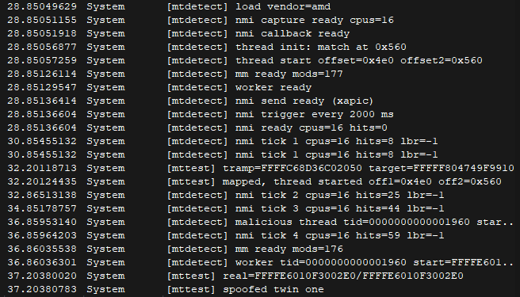

# malicious-thread-detection - NMI-based kernel thread detector

i kept wondering whether a driver can still catch hidden kernel threads after a rootkit unlinks their modules and rewrites their `ETHREAD` start addresses. so i built malicious-thread-detection as a poc to find out. it's two manually-mapped Windows kernel drivers. `mtdetect.sys` samples every CPU with non-maskable interrupts and judges each running system thread against three independent sources, and `mttest.sys` acts as the malware, including start-address spoofing and a pool trampoline for the lbr check.

to be clear: this is a poc, not a product. it detects the techniques it was built against, on the machine it was tested on. everything below about bypasses is stuff i believe is true from reading code and manuals, not stuff i have verified.

## what is this?

mtdetect is a kernel-mode detector with no unload path (both drivers are manually mapped and live until reboot). every 2 seconds it broadcasts an NMI to all CPUs via the local APIC. each CPU's NMI callback captures the running system thread's tid, both `ETHREAD` start-address twins, and the CPU's Last Branch Record pair. a DPC then scans the captures, and a passive worker thread re-validates suspects with a fresh module snapshot.

the bet is simple: spoofing one source shouldn't be enough to hide, the thread's twins, its creation-time baseline, the module list, and the silicon's own branch history all have to agree, and faking all four consistently is much harder than faking one field.

features:
- **NMI sampling** — APIC broadcast (xAPIC + x2APIC) to every CPU including self, per-CPU capture slots, tiny `HIGH_LEVEL` callback (field reads only, no locks/prints/alloc)
- **start-address twin check** — `ETHREAD` holds the start routine twice on system threads; the offsets are self-calibrated at load and any disagreement means somebody rewrote the field
- **creation baseline** — a `PsSetCreateThreadNotifyRoutine` table writes down every system thread's start addresses at birth, so later rewrites get convicted even when the spoofed value points at legit code like `ntoskrnl`
- **module check** — `AuxKlibQueryModuleInformation` snapshot; a start address backed by no known module is the classic manually-mapped driver smell
- **LBR silicon check** — probe-gated Last Branch Record capture; a `FROM` outside known modules branching into them is hook/trampoline evidence that doesn't trust `ETHREAD` at all, plus a read-only LSTAR watch
- **passive worker** — re-reads suspects with fresh modules (so newly loaded legit drivers don't false-positive), calls out exit/reuse races instead of misattributing them, and logs a second time-separated opinion on every finding
- **self-test driver** — `mttest.sys` runs a mapped worker thread, a pool-spin trampoline (`FROM` pool `TO` ntoskrnl branches for LBR), and staged single-twin then dual-twin spoofing with restore

## screenshots



*load sequence (vendor detect, capture slots, NMI callback, twin offset calibration, module snapshot, worker, APIC send, trigger), first NMI ticks with `lbr=-1` (probe dormant on my AMD vm), `mttest` mapping with its pool trampoline, then a malicious thread catch with worker confirm, baseline capture, and the single-twin spoof phase*

## how it works

1. **load** — `DriverEntry` detects the CPU vendor and LBR flavor, allocates per-CPU NMI slots, registers the NMI callback, self-calibrates the `ETHREAD` start-address offsets with a dummy thread, snapshots the module list, starts the passive worker, probes (never assumes) LBR support with `__try`-guarded MSR reads plus forced branches, maps the APIC, and arms a 2s timer DPC
2. **NMI broadcast** — the timer DPC scans the previous tick's captures, arms the pending-NMI counter, and sends one NMI to all CPUs including self
3. **capture** — each CPU's NMI callback (at `HIGH_LEVEL`, a dozen instructions) records tid, both start twins, and the LBR pair into its slot. foreign NMIs are declined so an unrelated NMI never bugchecks the vm
4. **spoof check** — the next DPC tick compares live twins against each other (mismatch) and against the creation baseline (drift). either one logs `spoof` with reason codes and queues the worker. this is the whole point: rewrites to legit addresses sail past the module check but die here
5. **malicious check** — surviving samples go against the module snapshot. unknown backing logs `malicious thread` with per-thread dedup so the log doesn't scream every 2 seconds
6. **silicon check** — valid LBR pairs are judged with zero `ETHREAD` trust: unknown-`FROM` into known-`TO` is a branch into the kernel from hidden code, an unknown youngest branch means hidden code is executing now. kernel-half only, all-zero (C-state) entries skipped, 50-slot unseen dedup
7. **worker confirm** — the passive thread refreshes modules, re-reads each queued suspect (`PsLookupThreadByThreadId` is `PASSIVE`-only, never called from DPC/NMI), and logs the second opinion. LSTAR gets compared against its load baseline, read-only, never restored

## how this could be bypassed (theory)

i haven't built or tested any of these:

- **be faster than the sampler.** this is the big one and it needs no kernel wizardry at all. i sample one thread per CPU every 2 seconds. anything that runs and finishes between two NMIs on a CPU never existed as far as i'm concerned. short-lived threads, bursty work, sleep 1900ms and work 100ms, sampling will probably never land on you. a 2s period catches residents, not visitors.
- **live in legit code.** my module verdict is only as smart as the module list. a BYOVD-style approach, abusing a signed, loaded, perfectly legitimate driver, starts threads whose addresses are all "known", twins match, baseline was recorded honestly at creation. every layer agrees and every layer is wrong. i detect *hidden* code, not *misused* code.
- **spoof before i load.** the baseline only knows threads born after it. a thread created before `mtdetect` maps has no entry (`UNKNOWN`), so consistently-spoofed twins pointing at `ntoskrnl` read as a boring legit thread. load order is a security boundary here and that's fragile.
- **turn off my silicon.** LBR only exists if `DEBUGCTL.LBR` stays set, and i re-arm it every NMI, but that's still a 2-second window. code that clears the bit on entry, does its business, and returns leaves no branch history behind. (on my AMD test vm the whole layer is dormant anyway, so there an attacker doesn't even have to bother.)
- **desync the NMI protocol.** my callback trusts a pending-counter to tell my NMIs apart from foreign ones, and declines anything it didn't send. somebody else sending NMIs, or a real hardware NMI arriving at the wrong moment, pushes that counter negative and my callback says "not mine", which hands the vm to `HalHandleNMI` and its bugcheck. that's a robustness hole i know about: unexpected NMIs can crash a machine running this.
- **rewrite the detector instead of dodging it.** the honest meta-answer. anyone with the same arbitrary kernel write i'm assuming for the attacker doesn't need to be subtle, patch my NMI callback, zero my slots, add their region to my module snapshot in memory, or just unlink my notify routine's bookkeeping. no in-kernel detector survives an equal-privilege attacker who knows it's there. i detect malware, not a targeted counter-driver author.
- **go where i don't look.** i only sample system threads (`PsIsSystemThread` filter), one thread per CPU per tick, and i never leave ring 0's view of the world. user-mode threads are out of scope by design, SMM is invisible to the OS entirely, and anything executing with interrupts' view of the machine that isn't a thread at NMI time simply isn't in my dataset.

## project structure

```
malicious-thread-detection/
├── CMakeLists.txt           # WDM driver targets, clang-cl, /kernel, unity build
├── CMakePresets.json        # windows Ninja preset
├── build.bat                # configure + build script
├── images/                  # screenshots
├── include/mtdetect/
│   ├── cpu/cpu.h            # vendor + LBR flavor detect
│   ├── cpu/msr.h            # constrained rdmsr/wrmsr helpers
│   ├── detect/detect.h      # DPC scan entry
│   ├── detect/worker.h      # passive verifier queue
│   ├── driver/driver.h      # DriverEntry
│   ├── lbr/lbr.h            # LBR probe, NMI capture, LSTAR baseline
│   ├── mm/mm.h              # module snapshot
│   ├── nmi/callback.h       # NMI callback register/arm
│   ├── nmi/capture.h        # per-CPU slots
│   ├── nmi/nmi.h            # subsystem init
│   ├── nmi/send.h           # APIC broadcast
│   ├── nmi/trigger.h        # timer DPC
│   └── thread/thread.h      # twin offsets, baseline table + verdicts
├── src/
│   ├── cpu/cpu.c            # cpuid vendor + family/model flavor pick
│   ├── cpu/msr.c            # rdmsr/wrmsr
│   ├── detect/detect.c      # spoof → malicious → LBR verdict order
│   ├── detect/worker.c      # passive recheck, LSTAR watch
│   ├── driver/driver.c      # DriverEntry, no unload (manually mapped)
│   ├── lbr/lbr.c            # probe-gated enable, NMI capture, re-arm
│   ├── mm/mm.c              # AuxKlib snapshot under spinlock
│   ├── nmi/callback.c       # HIGH_LEVEL capture, pending-counter protocol
│   ├── nmi/capture.c        # slot alloc
│   ├── nmi/nmi.c            # init order
│   ├── nmi/send.c           # xAPIC map / x2APIC ICR broadcast
│   ├── nmi/trigger.c        # 2s timer DPC, tick log with lbr status
│   └── thread/thread.c      # offset learning, notify baseline table
└── test/
    └── malicious.c          # mapped worker, pool-spin trampoline, twin spoof phases
```

## prerequisites

- **Windows x64, test VM only** (this writes `ETHREAD` fields and executable pool on purpose)
- **WDK 10** (`10.0.28000.0`, for `km` headers + `ntoskrnl`/`hal`/`aux_klib` libs)
- **LLVM with clang-cl** (the build rejects the Visual Studio generator, Ninja only)
- **CMake** (3.21+) and **Ninja**
- a mapper for loading (no unload routine exists by design), HVCI/VBS off, DbgView or a kernel debugger to see the log

## building

```cmd
build.bat
```

this configures the `windows` preset and builds `build\mtdetect.sys` and `build\mttest.sys`.

## notes

- both drivers are manually mapped and have no `DriverUnload`, teardown APIs are intentionally absent, everything lives until reboot
- the test driver's `ETHREAD` writes can trip PatchGuard (`0x109`) on hardened systems, that's the malware simulation doing its job, keep it on a throwaway VM
- LBR is strictly probe-gated: unreadable MSRs faulting, or registers reading back zero after forced branches, leave the whole layer dormant (`lbr=-1` on the tick line) with zero NMI overhead. twins + baseline don't care
- `RtlWalkFrameChain` only walks the *current* thread, so cross-thread stack attribution is deliberately not attempted, the worker re-reads fields instead of unwinding
- kernel `DbgPrint` pipelines drop lines under burst load (i proved it to myself the embarrassing way: two offset `match` prints execute, sometimes one shows). every finding gets a second time-separated worker line for exactly this reason, treat lone DPC lines as sufficient, worker lines as reliable

## what i learned

- a creation-time baseline turns spoofing from invisible into self-incriminating: the lie is only detectable if you wrote down the truth first
- NMI callbacks run at `HIGH_LEVEL` where almost everything is illegal, the whole design falls out of that constraint: capture raw, judge later, never touch a lock, print, or pageable API up there
- `RDMSR` on a nonexistent MSR raises `#GP`, so silicon features must be probed with `__try` at `PASSIVE` and cached, the NMI path must never be the first to touch an MSR
- AMD pre-Zen4 has no LBR MSRs at all, most hypervisors don't virtualize them, and deep C-states zero them, a silicon layer has to degrade to dormant silently or it's a crash bug, not a feature
- sampling a nanosecond branch with a 2-second NMI needs a persistent stimulus (pool spin), not a 2-instruction trampoline, detection math is duty cycle times depth
- and the uncomfortable one: sampling will always miss short-lived threads, so this whole approach catches residents, and a detector writeup that doesn't say that out loud isn't finished
